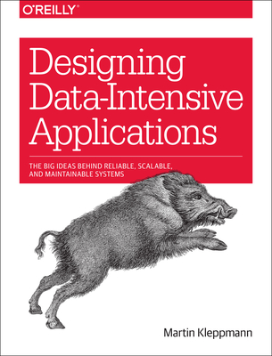

# Designing-Data-Intensive-Application

  

This repository contains comprehensive summaries of each chapter from the book *Designing Data-Intensive Applications* by Martin Kleppmann. It features PowerPoint presentations for every chapter, along with detailed docs that provide insights and key concepts discussed in the book. 

The repository is regularly updated to ensure that the content remains relevant and reflects any new developments in the field.
